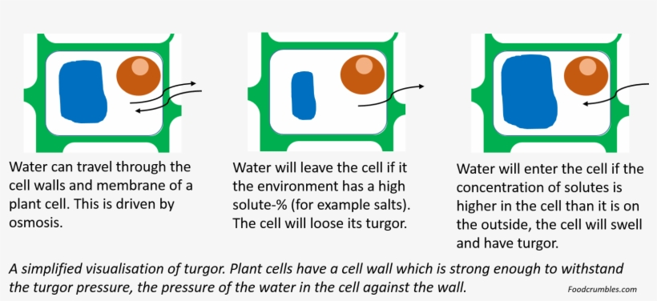
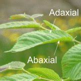
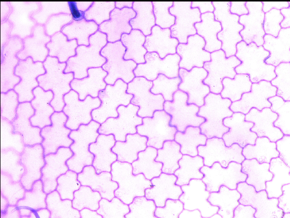
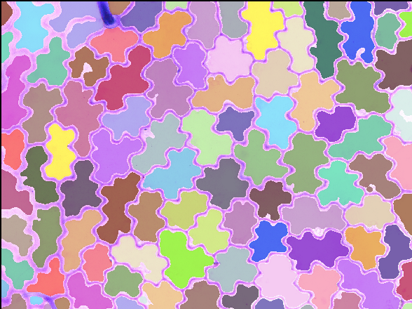
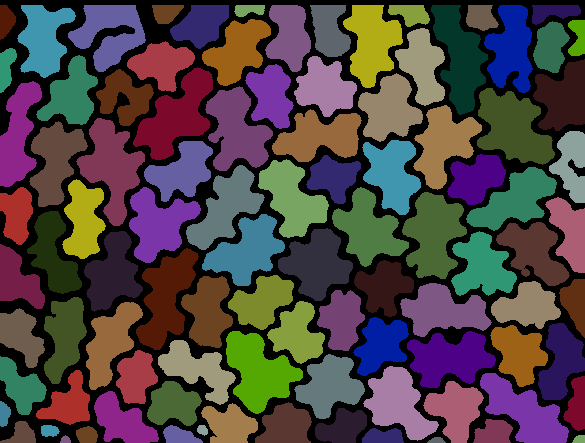
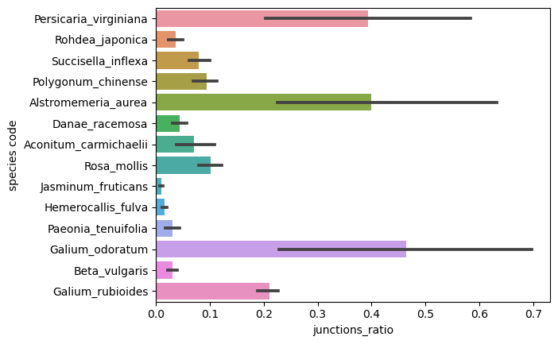
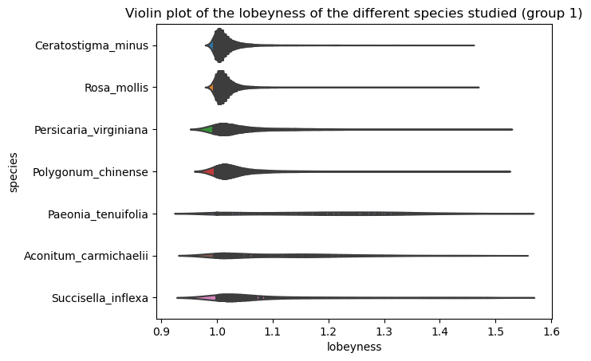
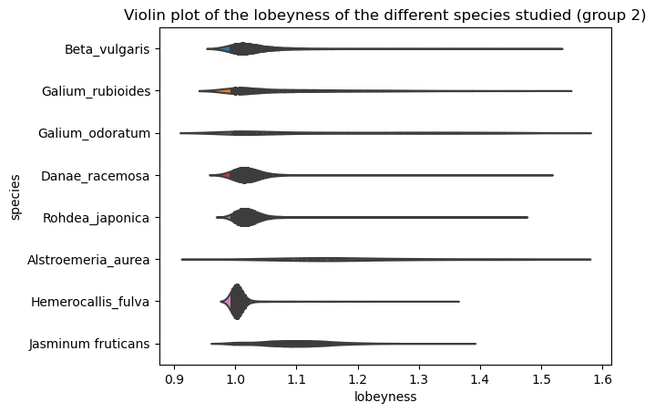
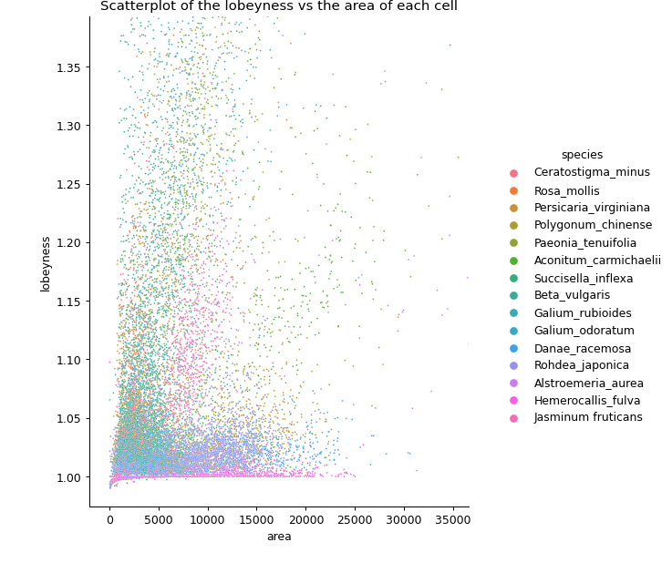
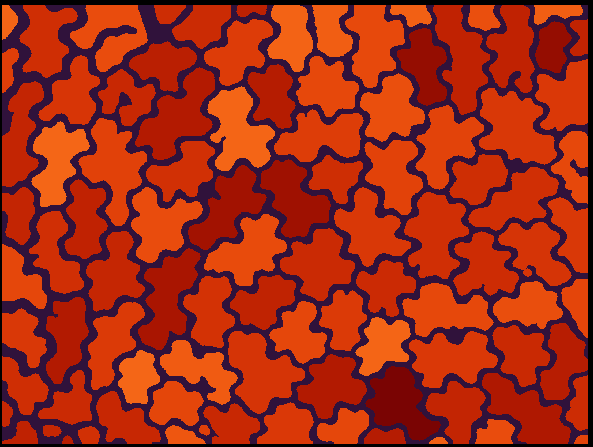

# **Project : Analyze leaf epithelium**

Camille Masanet

Léna Durosier

Elise Bodin

## **Introduction**

Before starting this project we read the article _Why plants make puzzle cells, and how their shape emerges_ and tried to understand the main notions of puzzle shaped cells in the epidermis of plants.

The article : 

Aleksandra Sapala, Adam Runions, Anne-Lise Routier-Kierzkowska, Mainak Das Gupta, Lilan Hong, Hugo Hofhuis, Stéphane Verger, Gabriella Mosca, Chun-Biu Li, Angela Hay, Olivier Hamant, Adrienne HK Roeder, Miltos Tsiantis, Przemyslaw Prusinkiewicz, Richard S Smith (2018) Why plants make puzzle cells, and how their shape emerges eLife 7:e32794

[https://doi.org/10.7554/eLife.32794](https://doi.org/10.7554/eLife.32794) 

We defined the following words to prepare our programming work.

Definitions :  

* **Turgor pressure**

The turgor pressure is the pressure produced by the fluid inside the plant cell on the plasma membrane which pushes it against the cell wall. The mechanical tension resulting from turgor pressure is necessary for the structure of the plant.

* **Abaxial / adaxial**

Abaxial describes the position of what is facing away from the axis (on a plant, the stem) and adaxial, of what is facing toward the axis. On a leaf, this means that the upper surface is the adaxial surface and the lower surface is the abaxial surface.

* **Epidermis, epithelium**

Epithelium is a type of tissue that was first discovered on the surface of mammalian breasts. It has since been studied and found in several other places, such as intestinal walls and airways, as it usually serves a protective role against external stresses and pathogens. This property is due to the tight junctions between cells which creates an impermeable barrier. 

The epidermis is an epithelial tissue that composes the skin, it’s made of several layers of kératinocytes which are highly protective cells. 

* **Microtubule**

Microtubules are microscopic and hollow structures with the shape of a rod, made of tubulin proteins. They are part of the cytoskeleton of  eukaryotic cells and provide them structure. They are also involved in a lot of cell processes such as cell division. 

* **Toluidine blue staining**

Toluidine blue staining is a basic stain that has an affinity with acidic components such as DNA, which means it will stain the cell nuclei blue. 

* **Cell wall, membrane**

The cell wall is the outer layer of cells (it also present in some bacteria,...). It has several functions and provides the cell with protection. This extracellular matrix is made of two or three layers : the middle lamella, made up mainly of pectin ,which acts as the cement between the cells, and the primary wall (for some cells there is also a secondary wall), made up primarily of cellulose.

The membrane is a protective layer around cells. In plant cells it is inside the plant wall. It is made up of mainly a bilayer of phospholipids and contains carbohydrates, proteins and lipids.

* **Isotropic ≠ Anisotropic**

Something that shows the same value when measured along axes in all directions. In the article they mention isotropic tissue growth, predicting that tissue elongation is not only in one direction. Their isotropic characteristic enables them to quickly reach their LEC (largest empty circle). That circle is the area of maximal stress in the cell wall. 

* **Isodiametric**

In the article they describe the cells as isodiametric cells, meaning they have the same diameter. This way they can compare their growth.

* **Interdigitation of cells**

They also mention the interdigitation of the cells. This means that they are interlocked and that the intercellular spaces are closed, this helps to stabilize the epithelium.

**Python dependencies **

This project has been made on jupyter notebooks.

* **Libraries** 

In this project we use the following libraries that we have to install: `napari`, `pandas`, `numpy`, `matplotlib`, `scipy`, `scikit-image`, `seaborn`, `sklearn`

You can install those libraries on the terminal with the following lines :

`pip install “napari[all]`

`pip install scikit-image pandas numpy matplotlib scipy scikit-image`

`conda install seaborn - c conda-forge`

`pip install -U scikit-learn`

You also need to import the following libraries :  `glob`, `tifffile`

## **How to use**

**0. Segmentation**

For the first and last question, we had to segment each image to label every cell from the image. This was made with different steps : 

* Step 1:

We sorted the images into different categories in order to code for the segmentation of a whole category. Indeed, we have images of 14 different plants, but within those images, some cells from the same leaf have different shapes and cannot be segmented with the same code. 

After having gone through all the images we established the six following categories : puzzle shaped cells, long rectangular cells, round cells, crocodile cells, rectangular/round cells and a special category for the 5.20 (_Succisella inflexa_) because the center of the cells were darker than the other ones. We had to modify the data arrangement and create folders with each of those 6 groups.

* Step 2 

Then we created 6 different functions with fixed segmentation parameters and called these functions to segment the images of each folder.  With another function, we saved those masks in a file (‘masks’) in the results.

Here is an example of the output of one these functions (the final image is the mask) : 

the original image : 

the mask layered on the original image :

the mask of the labelled cells :

**Limitations** 

The first issue we encountered was the stomata because of their shape. After the segmentation, we saw that depending on the image there were either counted as one cell or not counted at all. Because of the limited number of stomas and the fact that we didn’t use a lot of images where they were too important, we decided that we could not take them into account.

After testing the segmentation for the images we decided to not use some images for different reasons : 

3-07-400x-2-02 → cell overlay

4-17-400x-1-01 → stomata + several types of cells

4-17-400x-1-03 → stomas + several types of cells

4-17-400x-2-04 → poil sur la feuille 

5-22-400x-1-02 → cell overlay + dark shadows

5-22-400x-1-04 → cell overlay + dark shadows

6-21-400x-1-01 → stomata + very dark

6-21-400x-1-02 → stomata + very dark

6-21-400x-1-03 → stomata + very dark

6-21-400x-1-04 → stomata + very dark

7-23-400x-1-01 → stomata + very dark

7-23-400x-1-02 → stomata + very dark

7-23-400x-1-03 → stomata + very dark

7-23-400x-1-04 → stomata + very dark

7-23-400x-1-05 → stomata + very dark

4-01-700x-1-01 → stomata + very dark

4-01-700x-1-02 → stomata + very dark

4-01-700x-1-03 → stomata + very dark

4-01-700x-1-04 → stomata + very dark

1. **How many cells ?**

This is the first question we decided to deal with. Creating the segmented masks to count the cells and find their centroids will create the necessary database of masks to then be used in cell expansion. 

This code will give the three following results : 

* masks for all images _(stored in intermediate_results)_, 
* csv of the centroids of all images _(stored in how_many_cells)_, 
* a csv with the number of cells and filename of the centroid csv of all images _(stored in how_many_cells)_

Steps to follow : 

* Step 1 

Segment the images with the appropriate segmentation : 1 for each category.

Execute the six cells : this will save the masks for each category in the same folder named “masks”.

The segmentation functions called in the “save_mask” functions are defined in the .py document and are imported.

* Step 2

Create the centroid csv for all images. This code loops on all the masks created previously and creates one csv per mask. 

This csv contains three columns : ‘label’, ‘centroid-x’, ‘centroid-y’. X and y are the coordinates of each centroid, the label is the “name” of the centroid (from 1 to the total number of cells).

* Step 3

Create the final csv with three columns : “image name”, “number of cells”, “centroid csv filename”. This code loops on all masks as well.

**Limitations**

This code is not the shortest that we could have done. Instead of segmenting the different groups one by one we could have grouped the segmentation parameters for each category and looped them. We managed to do that for the second question. Another limitation is that inside the same category the segmentation can’t work perfectly on all images. With even more categories we could have had more precise segmentations.

2. **How are cells connected ?**

For this second question we had to create new masks, this time they were inverted as we wanted to keep only the cell walls and study their junctions.

This code will give the following results : 

* Junction masks for all images (_stored in intermediate_results)_
* One csv per image with its non-triangular junction centroids _(stored in how_are_cells connected)_
* A csv with 4 columns _(stored in how_are_cells connected)_
* A bar graph per species _(found in docs)_

Steps to follow : 

* Step 1

By testing segmentation parameters,  determine their values for all 6 categories and create a list named “parameters”. 

* Step 2

Segment all images in one loop by using the parameters list and fetching images in their particular folder. This function creates junction masks stored in intermediate_results.

* Step 3

The next step is to create the final csv. This csv uses 3 functions that are defined in the .py document associated. 

The final csv has four columns :

* Image name
* Number of non-triangular junctions
* Total number of junctions
* The file name of the non-triangular junction centroids csv file for this image
* Step 4

Create a bar graph. The x axis corresponds to all plant species, the y axis is the ratio of the number of non-triangular junctions on the total number of junctions.

Create the graph with seaborn. 

Result bar plot : 

**Limitations**

The limitations of this program are similar to the ones for “how many cells?” as segmentation isn’t ideal for all images. Keeping only the skeleton of the junctions was almost impossible as there was noise left in the center of certain cells.  The other limitation is that the minimal distance between two junctions that we use to determine the non triangular junctions (here 10 pixels) depends on the size of the cells on the image, and therefore varies highly with the zoom of the microscope. 

3. **How can we infer the cell expansion directions?**

This question requires that the masks have already been created and sorted into different files by species. In the file sent with the project , they can be found following this path : 

`Sorted_mask_result_path = project_path + ‘/results/sorted_masks’`

Steps to follow : 

* Step 1 

Creating a dataframe per species with the area, the perimeter, the convex hull perimeter and the name of the species. The lobeyness can be computed from this dataframe :

lobeyness =  cell perimeter / convex hull perimeter

For this step, use the function 

`measure_per_species(mask_species_result_path, species_name)`

* Step 2 

Creating a dataframe with all the labeled cells by concatenating the data frames previously made.

In this Project, we also decided to create 2 separate dataframes to split the four first species  and the last five to help the visualization with the violin plots. 

* Step 3 

Because of some segmentation issues we have some absurd values of lobeyness : 

From the article we read to prepare for this project we decided that values lower than 0.99 and higher than 1,5 were absurd values. On this step we clean those values in the 3 dataframes.

* Step 4 

Creating the plots using seaborn : 

* The violin plots (split in two groups for clearness)

From the lobeyness we can have information about the shape of the cells. Here, the violin plots show us that the species that have a lot of lobeyness value close to one (meaning that the cell shape is close to the convex hull, so a polygon around it) have mainly square shaped cells or close to a polygon. The ones that have the lobeyness values spread out (such as Galium odoratum) have more puzzle-shaped cells.

* The scatter plot

For this plot, this figure is a zoom of the actual plot because some cells have a higher area than 40000 , which we consider that are not normal values and are only due to segmentation errors.

* Step 5 ( optional ) 

Visualize the lobeyness on an example cell image with the function 

`parametric_map(mask_result_path, image_name)`

Here is an example of the output : 

**Limitations**

This question was really dependent on the quality of the segmentation (for the spatial features). Because of time limits some masks were not as satisfying as we would have liked, so the results might be distorted (for example a lobeyness inferior to 1).